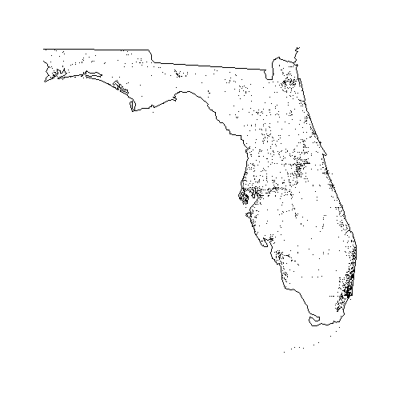

The `fars` package provides a series of functions to read, summarize and visualize [data](https://www-fars.nhtsa.dot.gov/Main/index.aspx) from the U.S. National Highway Traffic Safety Administration's Fatality Analysis Reporting System (FARS).  

Building this package was an assignment of the Coursera course "Building R Packages", offered by Johns Hopkins University as part of their Specialization "Mastering Software Development in R". The functions in the package were provided as input for the assignment and have only been slightly altered. At this point, they are only able to access data provided in the `extdata` folder existing inside the installation directory of the `fars` package. Work in progress. Or not.

## Functions provided and their usage


The `fars` package provides the following five functions: 

- `make_filename` 
- `fars_read`
- `fars_read_years`
- `fars_summarize_years`
- `fars_map_state`

Functions `fars_read` will read in all the data in a FARS file, whereas  function `fars_read_years` will select only the month and year columns for each year passed as argument and return the result as a list of tibbles if more than one year is passed. Each row in the output represents an accident report. 


```
## [[1]]
## # A tibble: 30,202 x 2
##    MONTH  year
##    <int> <dbl>
##  1     1  2013
##  2     1  2013
##  3     1  2013
##  4     1  2013
##  5     1  2013
##  6     1  2013
##  7     1  2013
##  8     1  2013
##  9     1  2013
## 10     1  2013
## # ... with 30,192 more rows
```

Function `make_filename` is a convenience function which systematically builds filenames for the FARS files from the year(s) provided as argument.

Function `fars_summarize_years` can be used to obtain the monthly totals of the number of accidents occured in the U.S. in one or several years. For example, running `fars_summarize_years(c(2013, 2014, 2015))` would result in:  


```
## # A tibble: 12 x 4
##    MONTH `2013` `2014` `2015`
##  * <int>  <int>  <int>  <int>
##  1     1   2230   2168   2368
##  2     2   1952   1893   1968
##  3     3   2356   2245   2385
##  4     4   2300   2308   2430
##  5     5   2532   2596   2847
##  6     6   2692   2583   2765
##  7     7   2660   2696   2998
##  8     8   2899   2800   3016
##  9     9   2741   2618   2865
## 10    10   2768   2831   3019
## 11    11   2615   2714   2724
## 12    12   2457   2604   2781
```

Function `fars_map_state` may be used to plot the locations of accidents in a given state. For example, calling `fars_map_state(state.num = 12, year = 2014)` will show a map of the state of Florida with the locations of accidents reported in 2014 indicated by black dots. 


```r
fars_map_state(state.num = 12, year = 2014)
```



The variable `state.num` takes the numeric [FIPS code](https://en.wikipedia.org/wiki/Federal_Information_Processing_Standard_state_code) of a U.S. state, which may also be found in the `state.fips` database provided in the `maps` package, which is partially shown below:


| fips| ssa| region| division|abb |polyname             |
|----:|---:|------:|--------:|:---|:--------------------|
|    1|   1|      3|        6|AL  |alabama              |
|    4|   3|      4|        8|AZ  |arizona              |
|    5|   4|      3|        7|AR  |arkansas             |
|    6|   5|      4|        9|CA  |california           |
|    8|   6|      4|        8|CO  |colorado             |
|    9|   7|      1|        1|CT  |connecticut          |
|   10|   8|      3|        5|DE  |delaware             |
|   11|   9|      3|        5|DC  |district of columbia |
|   12|  10|      3|        5|FL  |florida              |
|   13|  11|      3|        5|GA  |georgia              |

Note that this function may not be able to process all states in a given FARS file since it relies on the 48-state database provided by the `map` function in the `maps` package. For example, accident locations for the state of Hawaii, with `state.num = 15`, cannot be plotted; calling the function for this state will result in an error.
